# 温湿度測定システムの開発

## 目的

これまで学習したRTOS（TOPPERS/ASP）の知識を使用して、温湿度を測定するシステムを作成します。温湿度センサーからデータを取得してLCDに表示します。

RTOSの次の機能を使用します。★の数が多いと難易度が上がります。C言語やRTOSの理解に自信がない方は、周期ハンドラの課題の完成を目指しましょう。

1. タスク
1. 周期ハンドラ
1. イベントフラグ ★
1. セマフォ
1. データキュー ★★

## 基本機能の実装

フルカラーLEDを制御するタスク、温湿度センサーの情報を取得するタスク、温湿度センサーから取得したデータを加工するタスクと、変換後のデータをLCDに表示する3つのタスクを作成します。ハードウェアの初期化は初期化ハンドラを使用します。温湿度データはグローバル変数で管理します。

{width=90%}

<hr class="pagebreak">

<div id="table-caption">グローバル変数</div>

変数 | 説明
--|--
short temp10 | 温度データ（10倍した値）
short humi10 | 湿度データ（10倍した値）
char temp[10] | 温度データの文字列
char humi[10] | 湿度データの文字列

<div id="table-caption">MAINタスク</div>

項目 | 設定値
--|--
タスクID | MAIN_TASK
タスク属性 | TA_ACT
拡張情報 | 0
タスクの起動番地 | main_task
優先度 | MAIN_PRIORITY
説明 | 1秒ごとにフルカラーLEDを青色に点滅させる。

<div id="table-caption">温湿度取得タスク</div>

項目 | 設定値
--|--
タスクID | ENV_TASK
タスク属性 | TA_ACT
拡張情報 | 0
タスクの起動番地 | env_task
優先度 | MID_PRIORITY
説明 | 1秒ごとに温湿度センサーからデータを取得します。<br/>取得したデータはグローバル変数に保存します。<br/>生成した文字データは別のグローバル変数に保存します。<br/>データの保存後、データ変換タスクを起床します。

<div id="table-caption">データ変換タスク</div>

項目 | 設定値
--|--
タスクID | DATA_CHANGE_TASK
タスク属性 | TA_ACT
拡張情報 | 0
タスクの起動番地 | data_change_task
優先度 | MID_PRIORITY
説明 | グローバル変数からデータを取得します。<br/>取得したデータから文字データを生成します。<br/>生成した文字データは別のグローバル変数に保存します。<br/>保存が完了したら、LCD表示タスクを起床します。

<div id="table-caption">LCDタスク</div>

項目 | 設定値
--|--
タスクID | LCD_TASK
タスク属性 | TA_ACT
拡張情報 | 0
タスクの起動番地 | lcd_task
優先度 | MID_PRIORITY
説明 | グローバル変数からデータを取得します。<br/>取得したデータをLCDに表示します。

### 準備 Level 1.0

MAIN_TASKを含めて4つのタスクが正常に起動することを確認します。

- user.cfgファイルにタスク生成の静的APIを記述します。
- user.hにタスクが使用するC言語の関数のプロトタイプ宣言を記述します。
- main.cにグローバル変数を宣言します。
- main.cに4つのタスクを作成します。
  - すべてのタスクはパソコンにメッセージを表示して、`slp_tsk`サービスコールで待ち状態になります。

タスクとして使用するC言語の関数の基本的な構造を次に示します。

```c
void task(intptr_t exinf)
{
  syslog(LOG_NOTICE, "Task has been started.");

  while (1) {
    slp_tsk(); // 待ち状態
  }
}
```

実行結果の例です。

<div class="frame">

>TOPPERS/ASP Kernel Release 1.6.1 for AKI-RX621 Board (Nov 10 2024, 19:42:16)  
>Copyright (C) 2000-2003 by Embedded and Real-Time Systems Laboratory  
>                            Toyohashi Univ. of Technology, JAPAN  
>Copyright (C) 2004-2010 by Embedded and Real-Time Systems Laboratory  
>            Graduate School of Information Science, Nagoya Univ., JAPAN  
>Copyright (C) 2010 by Witz Corporation, JAPAN  
><br>
>MAIN_TASK has been started.  
>ENV_TASK has been started.  
>DATA_CHANGE_TASK has been started.  
>LCD_TASK has been started.  
>System logging task is started on port 4.  

</div>

### MAIN_TASKの実装 Level 1.1

システムが起動していることがわかるように、MAIN_TASKでフルカラーLEDの色を1秒間隔で点滅させます。

### ENV_TASKの実装 Level 1.2

温湿度センサーから1秒間隔でデータを取得します。

- 取得した温度データはグローバル変数のtemp10に保存します。
- 取得した湿度データはグローバル変数のhumi10に保存します。
- 取得したデータを確認するために（デバッグ）パソコンに表示します。

実行結果の例です。10倍した値になっています。tempの203は20.3℃、humiの664は66.4%です。

<div class="frame">

>temp is 203.  
>humi is 664.  
>temp is 203.  
>humi is 664.  
>temp is 203.  

</div>

### DATA_CHANGE_TASKの実装 Level 1.3

ENV_TASKからDATA_CHANGE_TASKを起床します。

温湿度データを「温湿度データの文字列」に変換します。

- グローバル変数temp10を文字列に変換して、グローバル変数tempに保存します。
- グローバル変数humi10を文字列に変換して、グローバル変数humiに保存します。
- 文字列の変換は温湿度センサーのデバイスドライバを使用します。
- 変換したデータを確認するために（デバッグ）パソコンに表示します。

実行結果の例です。

<div class="frame">

> temp is 202.  
> humi is 670.  
> temp is +20.2'C.  
> humi is 67.0%.  
> temp is 203.  
> humi is 670.  
> temp is +20.3'C.  
> humi is 67.0%.  

</div>

### LCD_TASKの実装 Level 1.4

DATA_CHANGE_TASKからLCD_TASKを起床します。
温湿度データの文字列をLCDに表示します。

- グローバル変数tempをLCDに表示します。
- グローバル変数humiをLCDに表示します。

実行すると、LCDに温度と湿度が表示されます。

<div class="frame">

+20.2'C  67.0%

</div>

## 周期ハンドラの実装 Level 2.1

温湿度データの取得はENV_TASK内で`dly_tsk`を使用して、1秒待ってから取得しています。
*他のタスクが動作している場合に優先度などの影響を受けて、1秒以上の時間がかかることがあります。*

他のタスクに影響されずに、1秒ごとに温湿度センサーから値を取得できるように修正します。
1秒ごとに起動する周期ハンドラを作成します。周期ハンドラから温湿度取得タスクを起動します。

{width=70%}

- 周期ハンドラをuser.cfgに定義します。
- 周期ハンドラが使用するC言語の関数のプロトタイプ宣言をuser.hに宣言します。
- 周期ハンドラをmain.cに記述します。
  - ENV_TASKを起床します。
- ENV_TASKを起床待ちに修正します。

修正前と同じ動作をします。

<hr class="pagebreak">

### スイッチによる制御 Level 2.2

スイッチを確認するタスクを追加します。

- スイッチ1（TSW1）を押すと、センサーのデータを収集を開始します。
- スイッチ2（TSW2）を押すと、センサーのデータ収集を停止します。

{width=70%}

<div id="table-caption">スイッチタスク</div>

項目 | 設定値
--|--
タスクID | SWITCH_TASK
タスク属性 | TA_ACT
拡張情報 | 0
タスクの起動番地 | switch_task
優先度 | HIGH_PRIORITY
説明 | 2つのスイッチ（TSW1とTSW2）を監視します。<br/>監視周期は10ミリ秒です。<br/>開始スイッチ（TSW1）が押されると、温湿度データ収集タイミング生成ハンドラを開始します。<br/>停止スイッチ（TSW2）が押されると、温湿度データ収集タイミング生成ハンドラを停止します。

最初に、スイッチが押されたことを確認する処理を追加します。

- user.cfgに、スイッチの状態を確認するタスクを追加します。
- user.hに、スイッチの状態を監視するタスクが使用するC言語の関数のプロトタイプ宣言を記述します。
- main.cに具体的な処理を記述します。
  - スイッチの立ち上がりを検出する処理を記述します。
  - 正常に動作していることを確認するために、パソコンに状態を表示（例 TSW1 is pressed.）します。

修正後の実行例です。スイッチ1やスイッチ2を押すと、パソコンにメッセージが表示されることを確認します。

<div class="frame">

> temp is +20.8'C.  
> humi is 66.1%.  
> TSW1 is pressed.  
> temp is 208.  
> humi is 661.  
> temp is +20.8'C.  
> humi is 66.1%.  
> TSW2 is pressed.  
> temp is 207.  

</div>

「温湿度センサーから値を取得するタイミングを生成する周期ハンドラ（DATA_ACQ_TIMING_HANDLER）」を制御する処理を追加します。

- user.cfgを修正します。システムの起動時に、周期ハンドラが停止状態になるように修正します。
- main.cのswitch_task（SWITCH_TASK）を修正します。
  - スイッチ1（開始）が押されたら周期ハンドラ（DATA_ACQ_TIMING_HANDLER）を開始します。
  - スイッチ2（停止）が押されたら周期ハンドラ（DATA_ACQ_TIMING_HANDLER）を停止します。

動作確認を行います。

- スイッチ1（TSW1）を押すと、温湿度収集が行われます。
- スイッチ2（TSW2）を押すと、温湿度収集が停止します。

実行例です。

<div class="frame">

> MAIN_TASK has been started.  
> ENV_TASK has been started.  
> DATA_CHANGE_TASK has been started.  
> LCD_TASK has been started.  
> System logging task is started on port 4.  
> TSW1 is pressed.  
> temp is 208.  
> humi is 661.  
> temp is +20.8'C.  

</div>

### LEDの色で動作モードを表示 Level 2.2a

温度収集の実行中なのか、停止中なのか分かりづらいので、フルカラーLEDの色で判断できるように修正します。

- 停止中は赤色が点滅します。
- 動作中は青色が点滅します。

LEDの色はMAIN_TASKで制御しています。状態をSWITCH_TASKで切り替えているので、SWITCH_TASKからMAIN_TASKに状態が変化したことを通知します。通知には、グローバル変数modeを宣言して使用します。

{width=90%}

- グローバル変数modeを宣言します。
- MAIN_TASKを修正します。
  - グローバル変数の値により、LEDで点灯する色を制御します。
- SWITCH_TASKを修正します。
  - 開始スイッチが押されたら、グローバル変数modeを開始状態に変更します。
  - 停止スイッチが押されたら、グローバル変数modeを停止状態に変更します。

### Beep音の導入 Level 2.2b

スイッチを押すと「ピッ」と音が鳴るようにします。音を鳴らすSPEAKER_TASKタスクを**起床**して音を鳴らします。起床されたSPEAKER_TASKタスクは、0.1秒だけ「ラ」音を鳴らします。

{width=90%}

<div id="table-caption">スピーカータスク</div>

項目 | 設定値
--|--
タスクID | SPEAKER_TASK
タスク属性 | TA_ACT
拡張情報 | 0
タスクの起動番地 | speaker_task
優先度 | HIGH_PRIORITY

- SPEAKER_TASKを作成します。
  - user.cfgにSPEAKER_TASKを定義します。
  - user.hにSPEAKER_TASKが使用するC言語の関数のプロトタイプ宣言を行います。
  - main.cにSPEAKER_TASKの処理を記述します。
- 初期化ハンドラでスピーカーを初期化します。
- main.cにspeaker_task関数を追加します。
  - スイッチが押されたらSPEAKER_TASKを起床します。

{width=90%}

<hr class="pagebreak">

## イベントフラグの導入 Level 3

SWITCH_TASKとMAIN_TASKはグローバル変数で通信を行っています。イベントフラグを使用して通知するように修正します。

今回の修正に合わせて、*フルカラーLEDを（点滅から）点灯する方式に変更*します。温湿度データ取得中は赤色、停止中は青色を点灯します。理由は後述のコラムを参照してください。

<div id="table-caption">イベントフラグ</div>

項目 | 設定値
--|--
イベントフラグID | FLAG_ENV
イベントフラグ属性 | TA_NULL
初期状態 | 0

イベントフラグの位置は定数（`#define`）で定義します。

<div id="table-caption">イベント</div>

項目 | 設定値
--|--
EVENT_START | 0x01
EVENT_STOP | 0x02

<div class="box26">
<span class="box-title">LEDの点滅を点灯に変更した理由</span>

動作状態を表すLEDは、MAIN_TASKで1秒ごとに点滅しています。イベントフラグ*待ちのサービスコール（wai_flg）を使うとタスクが停止*します。そのため、1秒ごとに点滅できません。

点滅させたいときは、タイムアウト機能付きのサービスコール（twai_flg）（未説明）を使用するか、点滅を行う周期ハンドラを使用するなど、別の構成を検討します。

</div>

- user.cfgにイベントフラグの生成を定義します。
- main.cにイベントを定義します。
- main.cにswitch_task関数を追加します。
  - SWITCH_TASKを修正して、スイッチ1（開始）が押されたら、開始イベント（EVENT_START）をイベントフラグで通知します。
  - SWITCH_TASKを修正して、スイッチ2（停止）が押されたら、停止イベント（EVENT_STOP）をイベントフラグで通知します。
- main_taskを修正して、イベントフラグを受信したらフルカラーLEDの色を変更します。
- グローバル変数modeを削除します。

ここまでの修正で、システムが正常に動作することを確認します。

SWITCH_TASKで「温湿度データ収集タイミング生成ハンドラ（DATA_ACQ_TIMING_HANDLER）」を制御していますが、MAIN_TASKで管理するようにプログラムを修正します。

- main.cのswitch_task関数（SWITCH_TASK）を修正します。DATA_ACQ_TIMING_HANDLERを開始、停止しているプログラムを削除します。
- main.cのmain_task関数（MAIN_TASK）を修正します。DATA_ACQ_TIMING_HANDLERを開始、停止します。

修正後のシステム図は次の通りです。

{width=90%}

## データ構造の導入 Level 4

これまでのプログラムは、温湿度データを個別のグローバル変数で管理しています。C言語は複数のデータを1つにまとめる**構造体**が使えます。構造体を使用するプログラムに修正します。

### 構造体の利用 Level 4.1

温湿度データを構造体で表現します。

```c
typedef struct {
  short temp10;
  short humi10;
  char temp[10];
  char humi[10];
} ENV_DATA;

ENV_DATA env_data;
```

{width=90%}

修正が必要なのは、ENV_TASK、DATA_CHANGE_TASKとLCD_TASKです。

- main.cに構造体を定義して、グローバル変数の一部（temp10とhumi10）を構造体に配置します。
- main.cのenv_task関数（ENV_TASK）のデータを保存するプログラムを、構造体を使用するように修正します。
- main.cのdata_change_task関数（DATA_CHANGE_TASK）の、データを取得、保存するプログラムを、構造体を使用するように修正します。
- main.cのlcd_task関数（LCD_TASK）のデータを取得、LCDに表示するプログラムを構造体を使用するように修正します。

### 排他制御の実装 Level 4.2

グローバル変数に複数のタスクがアクセスします。**セマフォ**を使用して排他制御を行います。

{width=90%}

グローバル変数のアクセスに**バイナリセマフォ**を使用します。

<div id="table-caption">セマフォ</div>

項目 | 設定値
--|--
セマフォID | SEM_ENV
セマフォ属性 | TA_NULL
初期値 | 1
最大値 | 1

- user.cfgでセマフォを定義します。
- main.cのenv_task関数（ENV_TASK）で、セマフォを使用してデータにアクセスするように修正します。
- mainc.のdata_change_task関数（DATA_CHANGE_TASK）で、セマフォを使用してデータにアクセスするように修正します。
- main.cのlcd_task関数（LCD_TASK）で、セマフォを使用してデータにアクセスするように修正します。

<div class="box26">
<span class="box-title">排他制御は必要でしょうか？</span>

排他制御は、複数のタスクやハンドラが同時に同じリソース（今回はグローバル変数）にアクセスすることで、データが不正な状態になることを防止する仕組みです。しかし、リソースにアクセスする度に、セマフォの獲得と返却を行うので効率は悪化します。

今回のシステムは、リソースにアクセスする同じ優先度を持つタスクが3つ（ENV_TASK、DATA_CHANGE_TASKとLCD_TASK）あります。ENV_TASKの処理が終了してからDATA_CHANGE_TASKを起動します。DATA_CHANGE_TASKの処理が終了してからLCD_TASKを起動しています。このように*順番に処理を行う場合は、複数のタスクが同時に同じリソースにアクセスすることはありません。よって、排他制御は必要ありません。*

</div>

## データキューの導入 Level 5

温湿度センサーのデータの取得を1秒間隔が行っています。データ取得の間隔を0.1秒に変更します。データ変換処理は、1秒間のデータの平均を計算してLCDに出力します。

*データ変換以降の処理が、「データ取得処理の間隔より時間が必要になることがある」と仮定します。*
そのため、データ取得タスクとデータ変換タスクの間はデータキューを使用し、処理速度の差を吸収します。

データの取りこぼしがないように、温湿度センサータスクの優先度をMID_PRIORITYからHIGH_PRIORITYに変更します。

{width=90%}

<div id="table-caption">データキュー</div>

項目 | 設定値
--|--
データキューID | DTQ_ENV
データキュー属性 | TA_NULL
個数 | 10
番地 | NULL

### データキューで使用するデータ構造

今回のシステムは、データキューに送信できるデータのサイズは32bitです。温度データが16bit、湿度データが16bitなので、温度データと湿度データを組み合わせて1つのデータとして扱います。上位16bitは温度データ、下位16bitは湿度データとします。

{width=60%}

- user.cfgを修正します。
  - データキューを定義します。
  - ENV_TASKの優先度をHIGH_PRIORITYに変更します。
- main.cの構造体の定義から、メンバーtemp10とhumi10を削除します。
- main.cのenv_task関数（ENV_TASK）を修正します。
  - センサーから取得した温度と湿度データを、データキュー用のデータに変換します。
  - データキューにデータを送信します。
- main.cのdata_change_task関数（DATA_CHANGE_TASK）を修正します。
  - データキューからデータを受信します。
  - データを配列に保存します。
  - データを10個受信したら、温度と湿度の平均値を計算します。
  - 温度と湿度の平均値の文字列データをグローバル変数に保存します。

正常に動作することを確認します。「温湿度データ取得タスクを起動する周期ハンドラ」（DATA_ACQ_TIMING_HANDLER）の設定を変更していないので、10秒の平均を求めています。

- user.cfgを開いて、周期ハンドラの周期を1秒から0.1秒に変更します。
- main.cのenv_task関数（ENV_TASK）の、パソコンへデータを出力する処理をコメントアウトします。

<div class="box26">
<span class="box-title">デバッグ用のコードの扱い</span>

開発中は、デバッグ用のコードを記述します。デバッグ用のコードは、製品をリリースするときは不要です。すべて手作業で削除することもできますが、慎重な作業が必要です。

C言語は`#ifdef`などのプリプロセッサ機能を使用して、デバッグ時だけビルド対象とするソースコードを記述することができます。

例

```c
#define DEBUG

#ifdef DEBUG
syslog(LOG_NOTICE, "デバッグメッセージ");
#endif
```

条件分岐を行う`#elif`なども使用できます。

</div>

<div class="box26">
<span class="box-title">データの処理</span>

平均の実装方法には、移動平均など別の計算方法もあります。
データをフィルタリングする方法は平均意外にも様々な方式があります。

</div>
